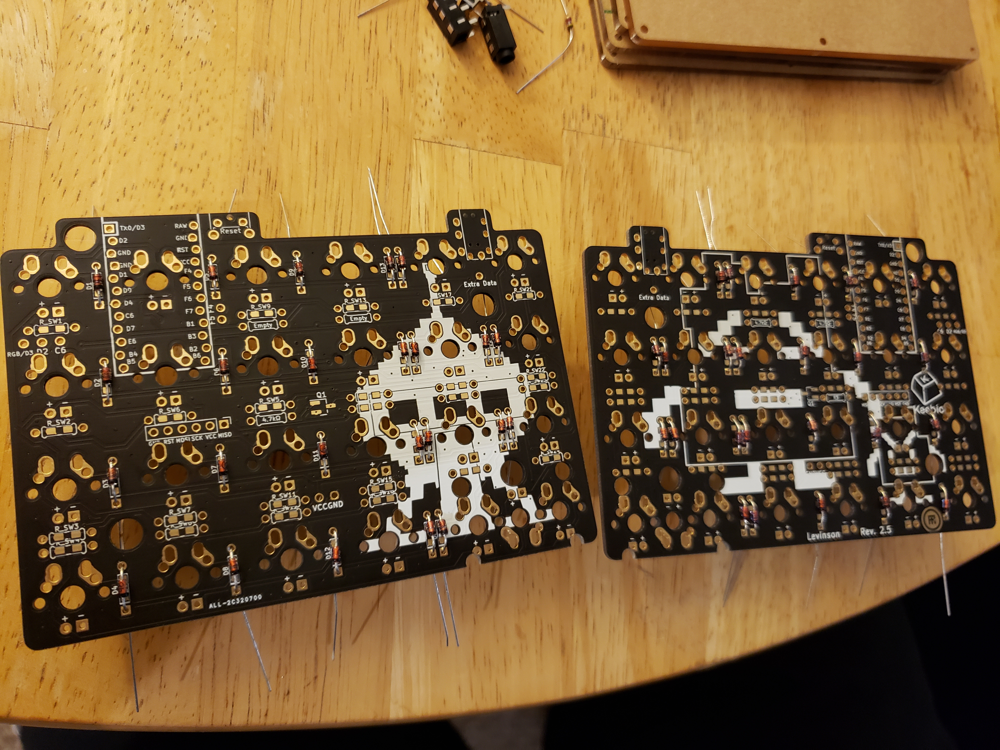
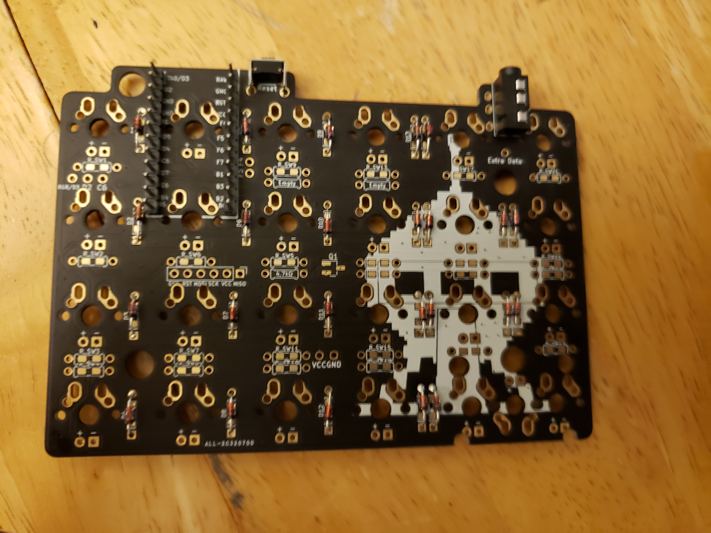
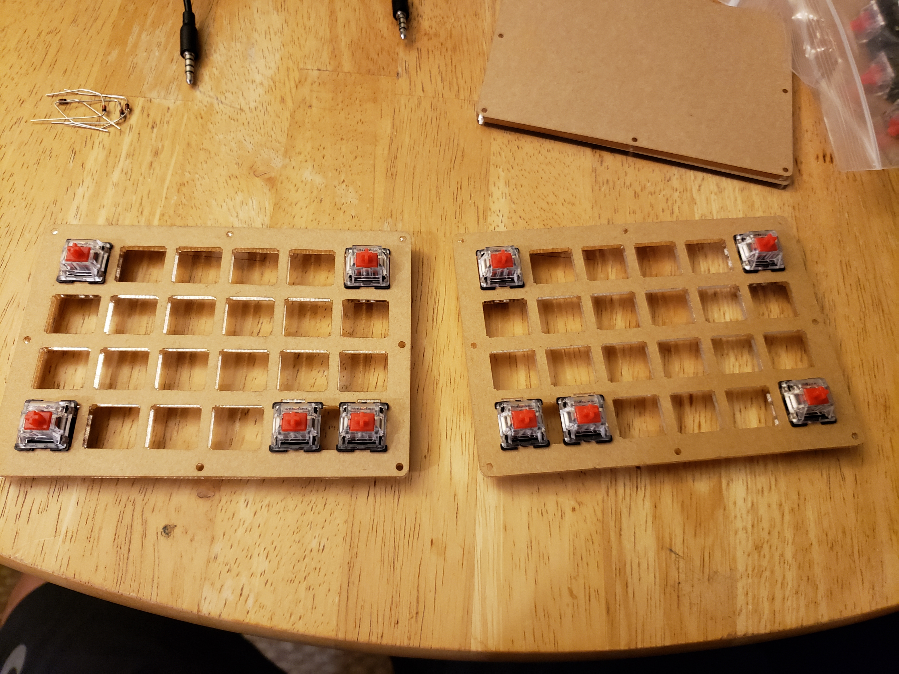
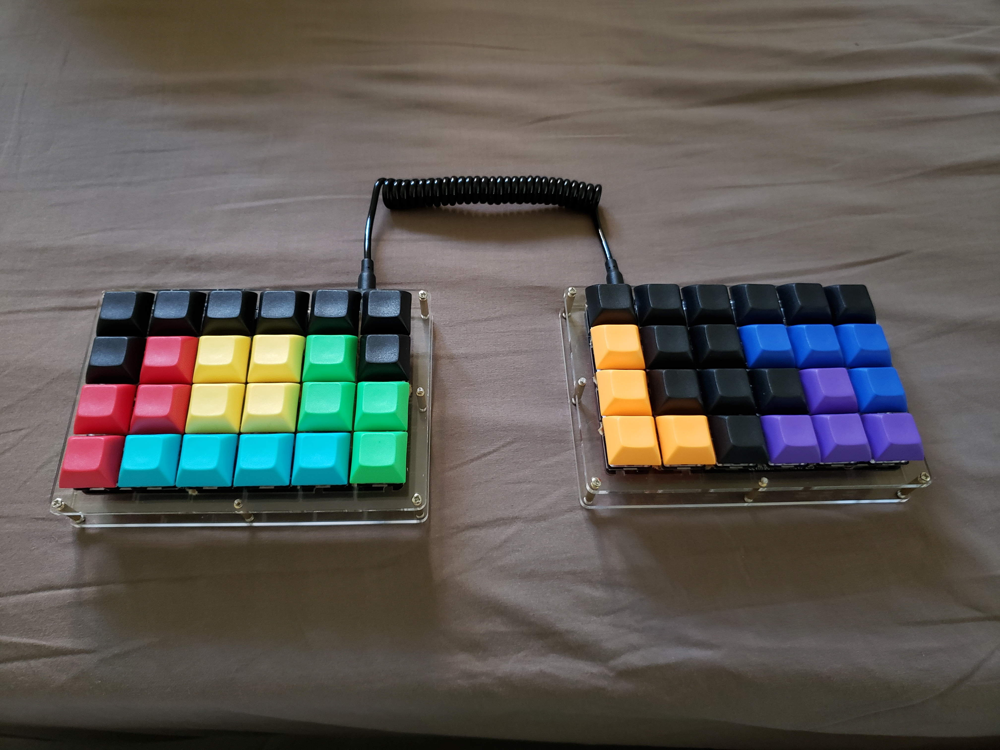
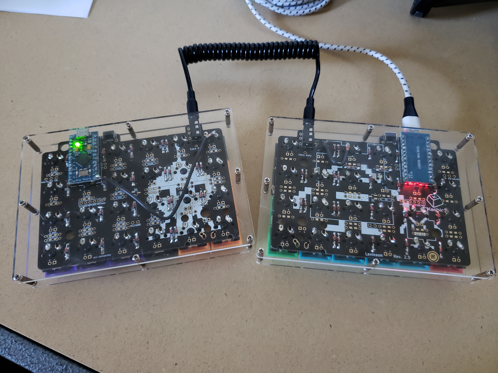

## To update firmware:
```
make keebio/levinson/rev2:keyaa:avrdude

make keebio/levinson/rev2:default:avrdude
```

Parts


PCBs with diodes


Mounting TRRS jack, reset switch, and microcontroller


Soldering diodes


Adding switches


Flashing microcontrollers


Attaching microcontrollers


Closing plates


Adding keycaps


Forgetting to peel from acrylic plates (lol)


Soldering external wires as a workaround fix (some keys were unresponsive)
